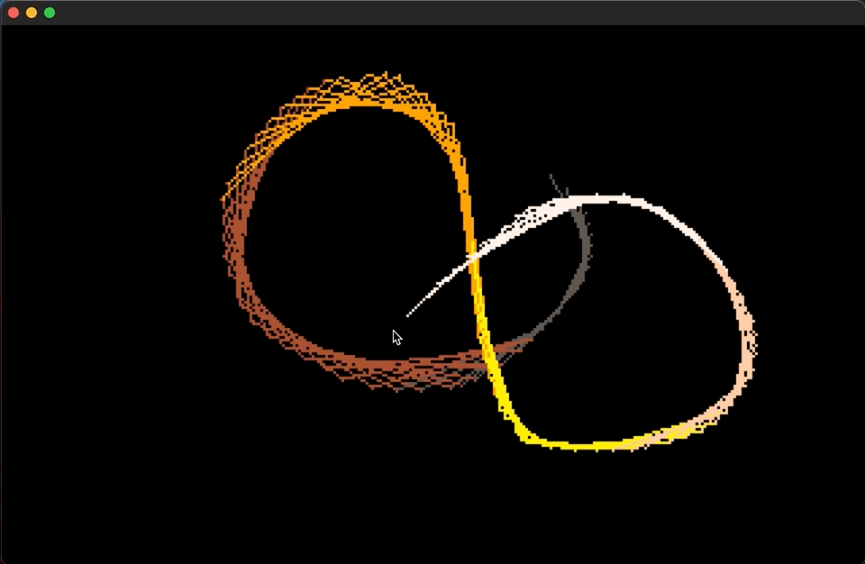

# Brass Engine

## Install

###  Clone

`$ git clone https://github.com/joshuaskelly/brassengine.git`

### Init Submodules

`$ git submodule update --init`

### Clean

`$ make clean`

## Building

Currently development is primarily being done on MacOS and assumes you have SDL2 installed somewhere.

### Desktop

Requires SDL2 and SDL2_mixer

Build:

`$ make desktop`

Run:

`$ ./build/bin/brass`

### Web

Requires emscripten

Build:

`$ make web`

Run:

`$ make web-run`

## Demos

3D Dot Party Demo

`$ ./build/bin/brass demos/3d_dot_party`

Lines Demo

`$ ./build/bin/brass demos/lines`